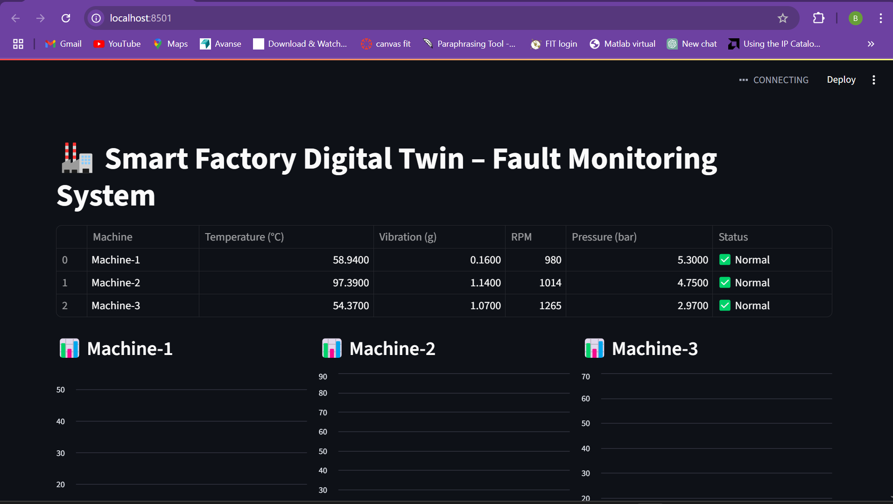

# 🏭 AI-Based Smart Factory Digital Twin with Realtime Fault Prediction & Visualization

## 📌 Overview
This project simulates a **Smart Factory Digital Twin** using Python, with real-time sensor data, AI-based fault prediction, and an interactive dashboard. It is a **100% software simulation** with no hardware required — perfect for demonstrating **Industry 4.0** and **IoT + AI integration** skills.

The system:
- Simulates data for **3 virtual machines** (temperature, vibration, RPM, pressure)
- Uses a **Random Forest Classifier** for real-time fault prediction
- Displays live machine status on a **Streamlit dashboard**
- Shows trends with real-time updating charts
- Can optionally log faults to cloud databases like Firebase

---

## 🎯 Features
- 🔄 Real-time **sensor data simulation**
- 🧠 AI-powered **fault detection**
- 📊 **Live updating dashboard** with charts and status
- 💾 Save and load trained models
- ☁️ Cloud logging support (optional Firebase integration)

---

## 🛠 Tech Stack
- **Python**
- **Pandas** – Data processing
- **Scikit-learn** – Machine Learning
- **Joblib** – Model persistence
- **Streamlit** – Dashboard & visualization
- **Matplotlib / Plotly** – Charts & graphs
- *(Optional)* **Firebase** – Cloud storage for alerts

---

## 📂 Project Structure

smart-factory-digital-twin/
├── data/
│   └── fault_dataset.csv                # Generated dataset for training
├── model/
│   └── fault_predictor.pkl              # Trained ML model
├── sensor_simulator.py                  # Live data simulation script
├── data_generator.py                    # Dataset creation script
├── train_model.py                       # ML training script
├── live_predictor.py                     # Live fault prediction script
├── dashboard_app.py                     # Streamlit dashboard app
├── Smart_Factory_Digital_Twin_Project_Report.pdf  # Project report
└── README.md                            # Project documentation


## 🚀 How to Run the Project

### 1️⃣ Install Dependencies
```bash
pip install pandas scikit-learn streamlit matplotlib plotly joblib

## Generate Dataset
python data_generator.py

## Train the Model
python train_model.py

## Run Live Predictions in Terminal
python live_predictor.py

## Launch the Dashboard
streamlit run dashboard_app.py


## **3️⃣ The Sample Output**
```markdown

## 📊 Sample Output (Terminal)
Here’s the live monitoring dashboard showing real-time machine status:

